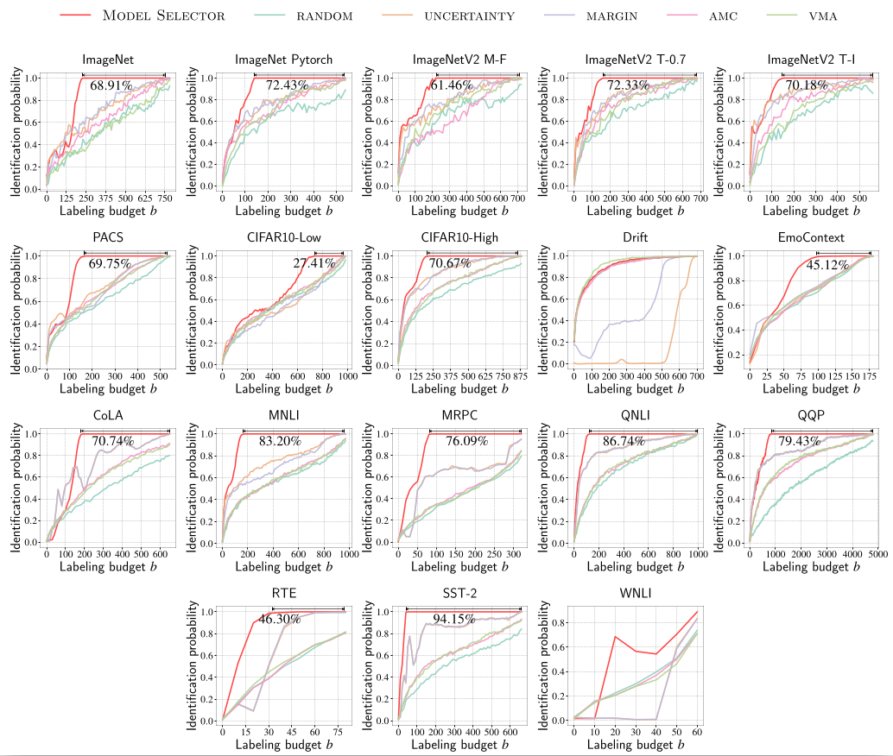

# All models are wrong, some are useful: Model Selection with Limited Labels ([PDF](https://arxiv.org/pdf/2410.13609))


## Abstract

We introduce Model Selector, a framework for label-efficient selection of pretrained classifiers. Given a pool of unlabeled target data, Model Selector samples a small subset of highly informative examples for labeling, in order to efficiently identify the best pretrained model for deployment on this target dataset. Through extensive experiments, we demonstrate that Model Selector drastically reduces theneed for labeled data while consistently picking the best or near-best performing model. Across 18 model collections on 16 different datasets, comprising over 1,500 pretrained models, Model Selectorreduces the labeling cost by up to 94.15% to identify the best model compared to thecost of the strongest baseline. Our results further highlight the robustness of ModelSelector in model selection, as it reducesthe labeling cost by up to 72.41% when selecting a near-best model, whose accuracy is only within 1% of the best model.

## Requirements

To create and activate a conda environment:
```setup
conda create -n model_selector python=3.10
conda activate model_selector
```

To install requirements:

```setup
pip install -r requirements.txt
```

## Datasets
All the necessary data is located at `resources/datasets`.


## Running The Code
Config files for reproducing the experimental results are at `resources/experiment_configs`.

Running Model Selector with for a given model collection:
```python
python scripts/run_benchmark.py -c <config_file.json>
```

Running grid search for $\epsilon$ parameter:
```python
python scripts/run_gridsearch.py -c <config_file.json>
```

## Analyzing Results
Code for recreating the plots is in this [notebook](src/plotting.ipynb).

## Results

### Identification Probability



## Citation
```
```